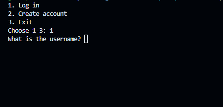

# High Score Tracker
***

This project allows you to play either tic tac toe or a number guessing game and it saves your score to your personal scores and, if it is good enough, to the top 10 leaderboard. You can view your scores, view the top 10 scores, or change your login information. An admin account can delete accounts or modify their login information.

## Use Instructions
***

1. Run main.py file
2. Log in
3. Play games, change login information, view highscores, or (if admin) modify accounts.

## Project Features
***
- Account creation, login, and modification
- Requires decently strong password
- Two playable games
- Seperate top 10 scoreboards
- Seperate personal scores
- Admin account functionality

## License Information
***
No copyright

## Contributors
***
- Stubbed-My-Toe
- FixedFusion2
- flumph3927
- Yourinthemood